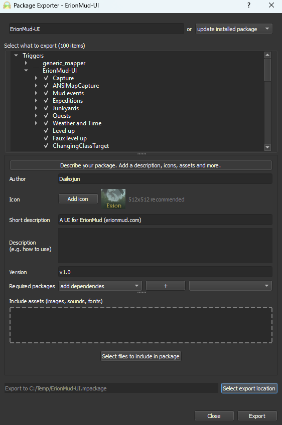
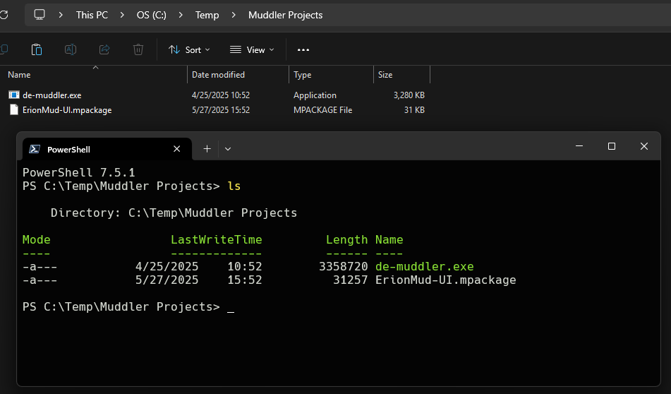
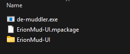

<!-- markdownlint-disable MD033 -->
# Build Process and Workflow

I build my packages in Mudlet then export to an IDE for fine tuning. This allows me to test everything and structure the project the way I like it. These are my steps to release a package.

- Create the package in Mudlet.
- Export the package from Mudlet using Package Exporter.
- Unpack the package using De-Muddler.
- Update and clean up any files using an IDE (i.e., VSCode).
- Create a new repository on Github or GitLab if needed.
- Pack the package using Muddler.
- Commit and push the whole project and the final package to the repo.

## Exporting the Initial Package

Once I have the package ready for release, I use the Package Exporter *(Toolbox -> Package Exporter)* in Mudlet to create the initial package.



Using the image above as reference, follow these steps.

- Enter the name of your new package in the top box with the placeholder, "Package name here".
- Expand Triggers, Aliases, and Scripts using the small arrow on the left.
- Expand the package folder under each category. "ErionMud-UI" is the package folder in this example.
- There is a small, almost invisible, checkbox on the left side of each listed item. Check the box for each item in the list you want to export as part of the package. In the example, everything in under Triggers/ErionMud-UI is checked.
- **NOTE: Mudlet will export everything you check into a folder structure that is named after the package name you entered in the top box. If you select the folder name above all your triggers, that folder will also be exported. This will give you an additional, and unwanted, folder in your new package's structure.**
  - For example, if you select "Triggers/ErionMud-UI/Capture" and export this package, your new package, when imported into a new profile, will have the structure, "Triggers/ErionMud-UI/ErionMud-UI/Capture".
  - This is why the image above shows that the root folder, "ErionMud-UI", is not checked.
  - So be sure you do NOT select the root folder of your package name or it will be duplicated.
- Once you have checked all the items you want to export as part of this package, click on the "Describe your package..." button at the bottom to open this section.
- Enter any information you want. It is highly recommended to add an author, a short description, and a verison at a bare minimum.
- Anything you enter in the Decscription box will be used to create the README.md file for the package.
- Select any required packages that are needed for your package to work.
- Drag-and-drop or click "Select files to include in your package" to add any additional resources your project needs.
- When done, choose "Select export location" and select where you want the *.mpackage* file to be placed once created.
- Finally, click Export to export your package. You will get a convenient link to open the file's location.

## DeMuddling the Initial Package

Download and set up DeMuddler according to the author's intructions.  
DeMuddler: [https://github.com/Edru2/DeMuddler](https://github.com/Edru2/DeMuddler)  
Releases: [https://github.com/Edru2/DeMuddler/releases](https://github.com/Edru2/DeMuddler/releases)  

Once you have DeMuddler extracted/installed, copy the executable *(ex: de-muddler.exe for Windows)* to the same folder with the *.mpackage* file. I have a folder called "Muddler Projects" that I use as a staging point for building packages. I copy the `de-muddler.exe` and the `ErionMud-UI.mpackage` file to this folder.  



Open a command prompt or console in this folder and run this command. I'm using `ErionMud-UI.mpackage` in this example.

```bash
.\de-muddler.exe -f .\ErionMud-UI.mpackage
```

You will get a new folder in your staging folder.



## Updating and Cleaning the Project in an IDE

At this point, I open this new folder in VSCode. Here I'll add the following files and folders. These files are stored outside of this folder initially so they are not overwritten or deleted during the muddling process.

- `.gitignore` - Keep `git` from adding select files and folders to the repo.
- `BUILD.md`
- `CHANGELOG.md`
- `INSTALL.md`
- `LICENSE`
- `README.md` - Remember, this file should have been created based on the text you put in the Description box in the Package Exporter. I usually just update this file after the export from the Scripts/README.lua file I create while in Mudlet.
- `build/` - This folder is created by the muddler process when exporting the source code in the last step. The `.gitignore` file has entries for this folder.
- `mfile` - Yes, this file was created by De-Muddler, but I update it manually.

### Update Notes

- Make sure to update the "ui.version" value in "Scripts/ErionMud-UI/1_UI_Start_Event".

## Muddling the Final Package

Download and set up Muddler according to the author's instructions.  
Muddler: [https://github.com/demonnic/muddler](https://github.com/demonnic/muddler)  
Muddler: Installation: [https://github.com/demonnic/muddler/wiki/Installation](https://github.com/demonnic/muddler/wiki/Installation)  
Muddler Usage: [https://github.com/demonnic/muddler/wiki/Usage](https://github.com/demonnic/muddler/wiki/Usage)  

I installed Muddler locally and added `muddle` to my path. This allows me to run it from any folder on my system.  

- Open a command prompt or console in the package folder. For this example, I'm using `C:\Temp\Muddler Projects\ErionMud-UI`.
- Simply run `muddle` in the root folder of the project. Muddler will build the package.

When Muddler is done, you should see the message `MUDDLER: [INFO]: Build completed successfully!` at the end of the text output in the console.  

You will now have a `build` folder inside your project folder. Inside the build folder should be 2 files and 2 folders:

- `ErionMud-UI.mpackage` - This is the final package that can be imported into Mudlet using the Package Manager.
- `ErionMud-UI.xml` - This is the final package, but in XML format.
- `filtered` - Delete this folder. It was part of the build process and is no longer needed.
- `tmp` - Delete this folder. It was part of the build process and is no longer needed.

## Committing the Project

I will commit and push this project folder to GitHub or GitLab, tag the commit as the next version release and select the `build/ErionMud-UI.mpackage` file as the next release.

And that's it!
