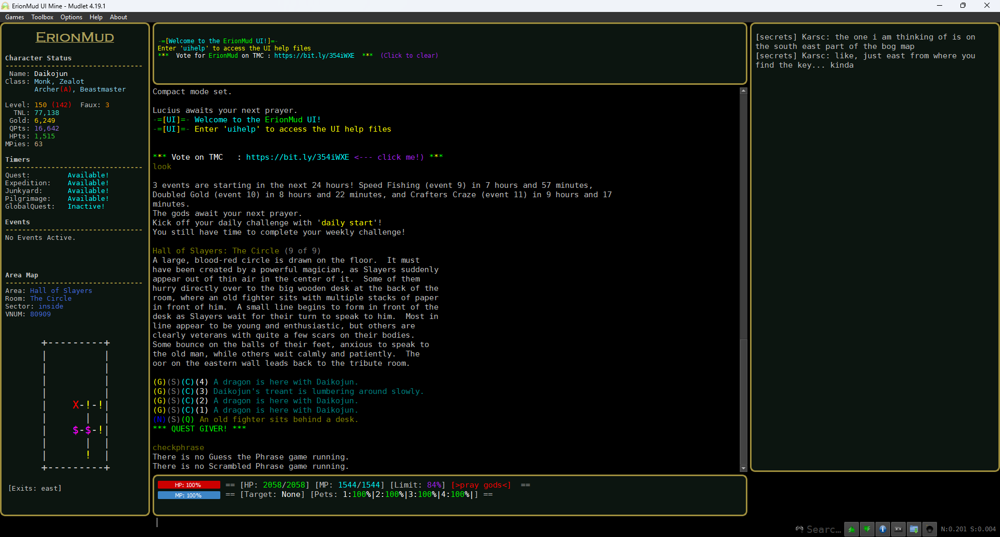

# ErionMud UI

Erion is an immersive medieval fantasy world since 2005 with a fun and friendly playerbase, challenging quests/missions, and an excellent class/skill system.

This [Mudlet](https://www.mudlet.org) UI was created and themed for [Erion Mud](https://www.erionmud.com).  
Based on the original package: ErionUI 1.0 by Caelinus [(github.com/Caelinus)](https://www.github.com/Caelinus)

See [INSTALL.md](INSTALL.md) for installation details.  
See [BUILD.md](BUILD.md) for instructions to build your own Mudlet package.

This package was built using [Muddler](https://github.com/demonnic/muddler) and [DeMuddler](https://github.com/Edru2/DeMuddler)

This project is completely free and open source. Feel free to clone, copy, and modify as you like.
